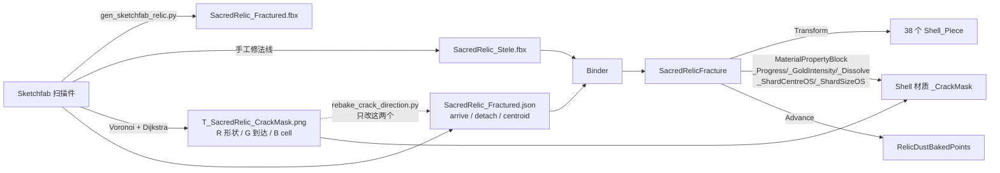

# 圣碑觉醒特效（Sacred Relic Awakening）接入说明

一座 16 m 高的石碑，表面**风化外壳**（泥壳、污垢、地衣、矿物结皮）沿 Voronoi 裂纹网络裂开 → 金光从缝隙渗出 →
被风掀起吹走 → 在飞行途中风化成沙，露出下面刻着碑文的**碑芯**。

**叙事约定（已锁定，改动前先确认）**：裂开、飞走、化沙的**永远只有外壳**。碑芯从头到尾完整存在，
它不参与破碎，只是被遮住、然后被露出来。金光的物主是碑芯，不是石块 —— 所以石块缝里的金光会随着
它掀起离开碑面而**衰减**，避免"碎渣才是宝贝"的观感。

---

## 1. 演出结构（四拍，互相重叠）

| 拍 | 内容 | 主要参数 | 驱动方式 |
|---|---|---|---|
| 1 | 裂纹从起点扫过整面外壳，金色纹路先亮起 | `crackDuration` `crackLead` | shader `_Progress` |
| 2 | 单块碎片缝隙金光涨亮、微微向外张开 | `seepDuration` `seamOpening` | shader `_GoldIntensity` |
| 3 | 碎片绕背风边缘掀起 → 被风带走 | `peelAngle` `burstReach` `burstTravelTime` | Transform |
| 4 | 碎片边缘溶解成沙，粒子从溶解前沿生成 | `dustDuration` `dustLead` `dustStagger` | shader `_Dissolve` + `RelicDustBakedPoints` |

每块碎片有**自己的时钟**，起点由它在裂纹波上的位置（`arrive` / `detach`）决定。所以同一时刻，
先裂的已经化成沙了，后裂的还没开始裂。

总时长 `TotalDuration = crackDuration + goldHold + dustLead + dustStagger + dustDuration`，
当前场景 = 3.2 + 0.55 + 0 + 0.3 + 2.5 = **6.55 s**。

---

## 2. 资产清单

```
Assets/Scripts/SacredRelic/
  SacredRelicFracture.cs          核心驱动，所有演出参数在这里
  SacredRelicTrigger.cs           触发入口（Space 觉醒 / R 复位 / OnTriggerEnter）
  RelicDustSource.cs              沙尘抽象基类
  RelicDustBakedPoints.cs         沙尘实现：烘焙表面点，单 ParticleSystem 单 DrawCall
  Shaders/SacredRelicShell.shader 外壳 shader：裂纹 + 金光 + 溶解
  Editor/SacredRelicSteleBinder.cs  一键接线（菜单 Tools/Sacred Relic/Bind Scene Stele）

Assets/Assets/SacredRelicDemo/
  SacredRelicAwakenDemo.unity     Demo 场景（当前调好的那个）
  M_Relic_Shell_Outer.mat         外壳风化面，_CrackStrength = 1
  M_Relic_Shell_Inner.mat         断裂面，_CrackStrength = 0
  M_Relic_Core.mat                碑芯，URP/Lit + Emission
  M_Relic_Dust.mat                沙尘粒子
  Generated/Models/
    SacredRelic_Stele.fbx         ★ 正在用的模型（碑芯 + 38 块外壳）
    SacredRelic_Fractured.fbx     程序化管线的产物
    SacredRelic_Fractured.json    ★ manifest：尺寸、38 块的 arrive/detach/centroid
  Generated/Textures/
    T_SacredRelic_CrackMask.png   ★ 裂纹图：R=裂纹形状, G=到达时刻, B=cell id
    Image_0.png                   原扫描件的 UV 图集（只给碑芯用）
    T_RelicDustGrain.png          沙粒贴图（64×64，待优化）
    DEBUG_Crack*.png              调试可视化，可删

Tools/Blender/
  gen_sacred_relic.py             共享工具：Voronoi、裂纹传播、mask 光栅化
  gen_sketchfab_relic.py          从 Sketchfab 扫描件切外壳 → Fractured.fbx + mask + manifest
  rebake_crack_direction.py       ★ 只重烘 mask + 时序，不动任何网格
Tools/Textures/
  gen_dust_grain.py               重新生成 T_RelicDustGrain.png（纯 stdlib，无依赖）
```

★ = 接入必需。

---

## 3. 快速接入（新场景）

1. 把 `SacredRelic_Stele.fbx` 拖进场景，物体名必须叫 **`SacredRelic_Stele`**（Binder 靠 `GameObject.Find` 找它）。
2. 菜单 **Tools → Sacred Relic → Bind Scene Stele**。它会自动完成：
   - 把碑体旋 180°（FBX 里碑文法线朝 +Z，转过来朝相机 −Z）
   - 关掉 `Stele_Body`（那是外壳未切开时的原始整体）
   - 识别 `Relic_Core` → 挂 `M_Relic_Core`，识别 `Shell_Piece_*` → 挂外壳材质
   - 从 manifest 读 38 块的 `arrive` / `detach`
   - 打开 FBX 的 Read/Write（沙尘烘焙要在 CPU 读网格）
   - 建 `Dust (Baked Points)` 子物体 + ParticleSystem + `RelicDustBakedPoints`
   - 挂 `SacredRelicFracture` + `SacredRelicTrigger`，摆好主相机
3. Play，按 **Space** 觉醒，按 **R** 复位。

不进 Play 也能看：Inspector 里勾 **Preview**，拖 **Preview Time** 滑块。

### 重绑是安全的

Binder 用 `freshComponent` / `freshMaterial` 双重保护：**只有组件/材质是新建的**才会写入默认数值。
已经存在的组件和材质，重绑只会重设**结构性**的东西（材质引用、`_CrackMask`、`_CrackStrength`、
shards 列表、instancing），手调的演出参数和 look 参数一律不碰。

想恢复出厂默认 → 删掉组件（或删掉 `.mat`）再重绑。

### 前提条件（照文档重建时最容易漏的三样）

**① 场景里必须有主光源。** 外壳用的是自写 shader，不是 URP/Lit —— 它在 `Shade()` 里自己
`GetMainLight()` + 遍历附加光 + `SampleSH()`。**没有 Directional Light，整座碑只剩环境光，接近全黑。**

当前场景（`_GlowStrength = 1.3` 就是在这套亮度下调出来的）：

| 灯 | 类型 | 强度 | 颜色 | 欧拉角 | 阴影 |
|---|---|---|---|---|---|
| Directional Light | Directional | 2.2 | (1.00, 0.96, 0.90) 暖 | (25, 15, 0) | Soft |
| Fill Light | Directional | 2.2 | (0.62, 0.72, 0.95) 冷 | (348, 145, 0) | 无 |

环境光 = Skybox，intensity 1。

**换灯光就得重调金光。** 两个 2.2 的平行光已经把石头照得不暗，金色是**加在**这个亮度之上的，
而项目没有 HDR —— 灯调亮一点，金光就会削顶变白（坑 3）；灯调暗，`1.3` 又会不够亮。

**② 包依赖。** `MRBase.SacredRelic` 引用了 `Unity.InputSystem`、`Unity.TextMeshPro`。
**缺任何一个，整个程序集都编译不过**（不只是少个功能）。
InputSystem 是 `SacredRelicTrigger` 的键鼠分支要的。

**③ 资产路径在 Binder 里是硬编码的**，文件夹改名或移动必须同步改 `SacredRelicSteleBinder.cs`：

```
Assets/Assets/SacredRelicDemo/Generated/Models/SacredRelic_Fractured.json   ManifestPath
Assets/Assets/SacredRelicDemo/Generated/Models/SacredRelic_Stele.fbx        EnsureSteleMeshesReadable
Assets/Assets/SacredRelicDemo/Generated/Textures/T_SacredRelic_CrackMask.png MaskPath
Assets/Assets/SacredRelicDemo/Generated/Textures/Image_0.png                AlbedoPath
Assets/Assets/SacredRelicDemo/Generated/Textures/T_RelicDustGrain.png       LoadOrCreateDustMaterial
Assets/Assets/SacredRelicDemo/M_Relic_Shell_Outer.mat / _Inner.mat          BindSceneStele
Assets/Assets/SacredRelicDemo/M_Relic_Core.mat / M_Relic_Dust.mat           EnsureCore/DustMaterial
```

shader 是按**名字**找的：`Shader.Find("MRBase/Sacred Relic Shell")` —— 文件可以挪，
但 `.shader` 第一行的名字不能改。

---

## 4. 运行时 API

```csharp
var relic = stele.GetComponent<SacredRelicFracture>();

relic.Trigger();          // 开始演出（已在播或已结束则忽略）
relic.ResetToSealed();    // 回到密封状态
relic.Evaluate(t);        // 直接定位到绝对时刻 t 秒，可用于时间轴/网络同步
relic.TotalDuration;      // 总时长
relic.CurrentPhase;       // Sealed / Cracking / Seeping / Bursting / Dusting / Awakened
relic.FaceNormal;         // 碑面朝向（世界空间）

relic.SetSpreadDirection(new Vector2(0,1), new Vector2(1,0));  // 切到 Directional 并指定方向
```

XR 接入：`SacredRelicTrigger.Awaken()` / `.Reseal()` 是无参 public 方法，直接挂到
XRI 的 `Select Entered` 或 poke 事件上即可。键鼠分支只是为了在编辑器里不戴头显也能审片，
上设备记得把 `allowEditorInput` 关掉。

---

## 5. 裂纹蔓延方向：两种模式

### FromManifest（**当前使用**）
方向是在 **Blender 里烘进 mask 的 G 通道**的。shader 逐像素比较 `arrival(G)` 和 `_Progress`，
所以能看到裂纹**一条一条长过去**。

改方向要重烘：
```bash
/Applications/Blender.app/Contents/MacOS/Blender --background --factory-startup \
  --python Tools/Blender/rebake_crack_direction.py -- --corner top-left
```
`--corner` 可选 `top-left / top-right / bottom-left / bottom-right / centre`。
当前 manifest 里 `crackOrigin = top-left`。

这个脚本**只写 mask PNG 和 manifest 的 arrive/detach**，不碰任何网格、FBX、blend。
它靠复现原始的"由中心向外"排序来还原 `Shell_Piece_NNN` ↔ cell 的对应关系，并用 manifest 里的
`seed2D` 做校验（当前最大误差 8.2e-06），对不上会直接报错退出，不会静默给错时序。

**注意**：这个模式下 Inspector 里的 `spreadFrom` / `spreadTo` / `spreadFrontWidth` 是**不起作用**的
（虽然还显示着）。方向来自烘焙数据。

### Directional
从 Inspector 指定 `spreadFrom` → `spreadTo`（碑面 0-1 坐标，x 左→右，y 下→上），
C# 按碎片质心在这条轴上的投影重算 `arrive` / `detach`，不需要重烘。

代价：`_Progress` 是每块一个标量，shader 只能把整块的裂纹网络**整体淡入淡出**，
没有"裂纹延伸过去"的感觉，只有一层层擦除感。**要真实的生长必须用 FromManifest。**

---

## 6. 组件参数速查（含当前调好的值）

### 裂纹蔓延方向
| 参数 | 当前值 | 作用 |
|---|---|---|
| `spreadMode` | FromManifest | 见上一节 |
| `spreadFrom` / `spreadTo` | (0,1) → (1,0) | 仅 Directional 生效 |
| `spreadFrontWidth` | 0.08 | 仅 Directional 生效，裂纹前沿宽度 |

### 拍 1 · 裂纹
| 参数 | 当前值 | 作用 |
|---|---|---|
| `crackDuration` | 3.2 | **整段演出的节奏基准**。调大 = 全都变慢 |
| `crackEase` | 线性 | 单块裂开的快慢曲线 |
| `crackLead` | 0.2 | **金光纹路的提前量**。见"坑 4" |

### 拍 2 · 金光渗出
| 参数 | 当前值 | 作用 |
|---|---|---|
| `seepDuration` | 1.4 | 缝隙金光涨到最亮要几秒（只影响发光） |
| `seamOpening` | 0.0193 | 缝张开时向外挪多少米，只为让缝可见 |

### 拍 3 · 掀起吹走
| 参数 | 当前值 | 作用 |
|---|---|---|
| `goldHold` | 0.55 | 裂开后在原地亮着停留几秒；掀起动作也在这段完成 |
| `faceNormalLocal` | (0,0,1) | 碑面朝向，Binder 自动算，**不要手改** |
| `tearRandomness` | 0.065 | 0 = 全部同方向掀；1 = 每片面内完全随机选方向 |
| `windForward` | 0.1 | 脱离碑面朝相机飞的分量（只影响方向，会归一化） |
| `windUp` / `windRight` | 0.01 / 0.03 | 基准撕开方向。`tearRandomness` 越小越明显 |
| `windSpread` | 14 | 额外随机抖动角（度），防止抽到同角度的片整体平移 |
| `minForward` | 0.232 | **防陷进石头**：离面分量下限（与法线点积） |
| `wallClearance` | 0.804 | **防穿模**：先离面、再横向铺开的程度。终点不变 |
| `radialFan` | 0.543 | 按自身位置向外发散。>0 会把碑下半的碎片往下带 |
| `peelAngle` | 15 | 绕背风边掀起的角度。0 = 不掀，整块平移 |
| **`burstReach`** | **10** | **← 想让石块飞更远改这个**（米） |
| `rimReach` | 0.75 | 最晚脱落的能飞到 `burstReach` 的百分之多少 |
| **`burstTravelTime`** | **2.5** | **← 想让石块飞更快改这个**（秒，调小=更快） |
| `spinDegrees` | 60 | 全程自转总角度。保持小值，这是薄片被风带得打转 |

### 拍 4 · 风化成沙
| 参数 | 当前值 | 作用 |
|---|---|---|
| `dustDuration` | 2.5 | 单块从开始消散到消失几秒 |
| `dustStagger` | 0.3 | 各块开始消散时刻的随机错开范围（秒） |
| `dustLead` | 0 | 起飞后过几秒开始消散。0 = 一起飞就开始化 |

### 碑芯圣光
| 参数 | 当前值 | 作用 |
|---|---|---|
| `coreGlowColor` | (1, 0.72, 0.32) | 圣光颜色，写进碑芯 `_EmissionColor` |
| `coreGlowStrength` | **0** | 当前**关掉**了（曾试过加法辉光层，观感被否，已删） |
| `coreGlowOverTime` | 0→0.12→1→0.22 | 峰值故意留在 0.68 而非结尾：光一直亮着碑文就看不清 |
| `coreRestoreProperty` | `_Restore` | **死线**。URP/Lit 没这个属性，只留给自定义碑芯 shader |

---

## 7. 材质参数（`SacredRelicShell.shader`）

两个材质共用同一 shader，唯一的结构差异是 `_CrackStrength`：

| | Outer（风化面） | Inner（断裂面） |
|---|---|---|
| `_BaseColor` | (0.145, 0.118, 0.090) 深褐 | (0.470, 0.430, 0.365) 浅砂 |
| `_CrackStrength` | **1** | **0** |

其余当前一致：

| 属性 | 当前值 | 说明 |
|---|---|---|
| `_BaseMap` | **空** | **不要挂 `Image_0`**。见"坑 6" |
| `_GrooveColor` | (0.02, 0.016, 0.012) | 裂纹凹槽色，接近黑 |
| `_GrooveDepth` | 1 | 凹槽压暗强度 |
| `_GlowColor` | (1, 0.63, 0.22) | 金光颜色 |
| `_GlowStrength` | **1.3** | 无 HDR，超过 ~1.5 就会削顶变白。见"坑 3" |
| `_TipBoost` | **1.8** | 裂纹**生长前沿**的额外增亮，这是"正在裂开"的关键 |
| `_TipWidth` | 0.05 | 前沿亮带宽度 |
| `_CrackSoftness` | 0.14 | 裂纹显现的软边。**必须小于 `crackLead`** |
| `_NoiseScale` | **9** | 单位是"**每块碎片几个 cell**"，不是每米。见"坑 7" |
| `_GrainScale` | 2.6 | Worley 颗粒频率 |
| `_GrainStrength` | 0.75 | fbm 与 Worley 的混合比。调高 = 边缘更像沙粒 |
| `_EdgeWidth` / `_EdgeStrength` | 0.06 / 2.1 | 溶解边缘的橙色发光带 |
| `_DissolveMode` | 0 | 0 = 噪声溶解；1 = 轴向切片（对齐 INab 的 Object Axis Mask） |

Shader 的三个 Pass（ForwardLit / ShadowCaster / DepthOnly）都做了 `clip(DissolveKeep(...))`，
所以溶解掉的部分连阴影和深度都会一起消失。`Cull Off` 是因为薄片翻转后会看到背面。

### 沙粒贴图

`T_RelicDustGrain.png`（128×128 RGBA）由 `Tools/Textures/gen_dust_grain.py` 生成，改参数重跑即可：

```bash
python3 Tools/Textures/gen_dust_grain.py
```

它画的是**一小簇 46 个多边形砂粒**（5-7 个随机半平面求交），不是一团高斯光斑。
原因：粒子在 16 m 的碑上只有 0.07-0.22 m，一个billboard 上必须自带碎的轮廓，
否则小到几像素时会退化成圆点，读起来是雾或者 bloom 光斑，不是沙。
最早试过正弦扰动轮廓，出来是**雪花/枫叶形**，那是沙唯一不可能有的形状，所以改成多边形。

- 颜色只在 RGB 上留轻微明暗差，**色相全部交给** `M_Relic_Dust._BaseColor` 和粒子的
  `colorOverLifetime` 渐变
- alpha 在四边强制归 0，`wrapU/V = Clamp`，所以永远看不到 quad 边
- 平均 alpha 刻意做到 **0.147**，对齐它替换掉的那张老图（0.157）：mip 会把远处的 billboard
  平均成这个数，做得太稀会导致近处更实、**远处反而更淡**

---

## 8. 数据流



每帧走 `MaterialPropertyBlock` 而不是 `material.SetFloat`，避免 38 份材质实例。
`_ShardCentreOS` / `_ShardSizeOS` 也走这条路 —— 它们是每块不同的，所以溶解噪声可以按碎片
自身尺寸归一化（见"坑 7"）。

---

## 9. 坑（每一条都是实际踩过的）

### 坑 1 · submesh 数少于材质数 → 后一个材质把前一个整体重绘覆盖
**症状**：金色裂纹完全消失，整面变成均匀浅砂色。

Unity 遇到材质数 > submesh 数时，会用多余的材质把**最后一个 submesh 再画一遍**。
Sketchfab 那条管线的 `make_crust_piece` 从不设 `material_index`，所有面都在索引 0 → 导出只有
1 个 submesh。于是 `M_Relic_Shell_Inner`（`_CrackStrength = 0`，设计如此）在同一深度把 Outer
盖掉重绘，mask 被乘成 0。

`{outer, inner}` 这套是给**程序化管线**的：那边 prism 顶盖 = `MAT_OUTER`、侧壁 = `MAT_INNER`，
真有 2 个 submesh。Binder 现在按实际 submesh 数决定给几个材质：
```csharp
int submeshes = filter?.sharedMesh != null ? filter.sharedMesh.subMeshCount : 1;
rend.sharedMaterials = submeshes >= 2 ? new[]{ outer, inner } : new[]{ outer };
```
**换模型时如果金光又没了，第一件事查这个。**

### 坑 2 · 网格自带世界坐标偏移 → 所有 Transform 原点都在碑底
**症状**：碎片转着大圈飞出去，最后往下沉。

外壳网格是带 baked vertex offset 导出的，`positionOS` 实际就是世界坐标。因此 38 个
`Shell_Piece` 的 Transform 原点**全都叠在碑底（世界原点）**。直接写
`rotation = AngleAxis(...) * rotation` 会让一块在 12 m 高处的碎片绕碑底旋转 —— 那就是画圈。

解法：`Evaluate()` 里额外跟一个 `centroid`，所有旋转都显式换轴心：
```csharp
position = centroid + tumble * (position - centroid);
```
掀起动作同理，绕 `hingePivot` 而不是 Transform 原点。

第二个下沉源头是 `radialFan`：它用的是"由碑心指向外"的向量，所以 >0 会把碑下半部分的碎片往下带。

### 坑 3 · 关了 HDR，`_GlowStrength` 大于 ~1.5 就削顶变白
项目 URP 是 `Standalone Performant Preset`，`supportsHDR = False`，没有后处理，场景里 0 个 Volume。
`(1, 0.63, 0.22) × 7 = (7, 4.4, 1.5)` → 三个通道全部钳到 1 → **纯白**，金色荡然无存。

Binder 里给新材质播种的 7 是给 HDR 项目留的，现在实际用 **1.3**。

Quest / Pico 上不要开 Bloom：TBDR 移动 GPU 上后处理会打断 tiled rendering、
让 tile 内 MSAA resolve 变贵，还会干扰 foveated rendering 和 SpaceWarp。
（试过用加法几何层伪造溢出感，观感被否，相关文件已删除。）

### 坑 4 · `crackLead` 不是装饰，`0` 就看不见金光
manifest 里一个 cell 的 `detach` **就是它自己轮廓上最大的 arrival 值**。所以 lead = 0 时，
裂纹刚画完这块的最后一笔，它同一瞬间就脱落飞走了 —— 金光根本没有停留在屏幕上的时间。

`crackLead` 让显现前沿比脱落提前一截（当前 0.2），并允许 `crackGlobal` **超过 1**，
这样最后几块的缝也来得及亮。约束：**`crackLead` 必须 > 材质的 `_CrackSoftness`**（0.14）。

### 坑 5 · `Mathf.SmoothStep` 不是 HLSL 的 `smoothstep`
`Mathf.SmoothStep(from, to, t)` 是在 **from 和 to 之间插值**，不是 `smoothstep(edge0, edge1, x)`。
写成 `Mathf.SmoothStep(0f, 0.12f, crackWave)` 会把 lead 缩成 `0.2 × 0.12 = 0.024`。正确写法：
```csharp
float leadRamp = Mathf.SmoothStep(0f, 1f, Mathf.Clamp01(crackWave / 0.12f));
```

### 坑 6 · 不能给外壳挂 `Image_0`
`Image_0.png` 是**扫描件的 UV 图集**，而外壳碎片用的是世界 XZ 平面投影 UV，两者毫无对应关系。
采样出来是图集碎片拼成的高对比迷彩，会把细的金色裂纹线彻底埋掉。`Image_0` 只给碑芯用。

（附带教训：判断"金光有没有回来"用暖色像素计数会被这张暖棕色照片纹理骗到 —— 必须真的把
RenderTexture 存成 PNG 看一眼。）

### 坑 7 · 溶解噪声必须按碎片尺寸归一化
`positionOS` 实际是世界米数，在 16 m 的碑上跑到 16。直接乘 `_NoiseScale = 42` 得到 2.4 cm 的
cell —— 整碑入画时远小于一个像素，`clip()` 出来是**满屏爬行的噪点**。

现在先除以碎片自身 bounds：
```hlsl
float3 p = (positionOS - _ShardCentreOS.xyz) / max(1e-4, _ShardSizeOS.x) * _NoiseScale;
```
于是 `_NoiseScale` 的语义变成"**这块碎片上几个 cell**"，9 是合适值。
`_ShardSizeOS` 用三轴里最大的那一个（各轴独立会把这些扁平薄片上的颗粒拉花）。

### 坑 8 · 掀起 → 吹走之间的卡顿
掀起动作在 `goldHold` 结束时**硬停**，此时铰链还带着 ~0.7 m/s；而飞行曲线 `2u² − u³` 的
起始速度是 **0**。两者一交接就是一个明显的顿。

解法是让两段重叠、并给飞行曲线加线性项：
```csharp
float peelSpan = Mathf.Max(0.05f, goldHold + burstTravelTime * 0.2f);   // 掀起延续到起飞后
float ease = Mathf.Lerp(u, u * Mathf.Lerp(u, 1f, u), 0.65f);            // 0.35u + 0.65(2u²−u³)
```
实测交接处最低速度从"完全静止"变成 1.97 m/s。末端斜率仍是 1（不做 ease-out —— 那会读成"被扔出去"
而不是"被风托着")。

### 坑 9 · Edit Mode 下拖 Preview 滑块会把碎片位置永久搞飞
`CaptureRestPoses()` 原来在 edit mode 无条件重读 Transform，滑块拖到一半时读到的是
**飞行中的姿态**，被当成新的 rest pose 存下来 → 整个外壳永久停在那儿。

两处都已封堵：
```csharp
if (!s.restCached || (!Application.isPlaying && !preview)) { /* 重读 */ }
```
```csharp
void OnValidate() { ...; if (!preview) ApplySealed(); CacheRest(); if (preview) Evaluate(...); }
```
（`OnValidate` 的顺序也很关键：取消勾选 Preview 会触发它，必须先 `ApplySealed()` 把碎片放回去
再 `CacheRest()`。）

万一还是飞了：选中 38 个 `Shell_Piece` 的 Transform → 右键 `Revert` 覆盖 → 重绑。

### 坑 10 · 溶解噪声有两份（GPU + CPU），改一份必须改另一份
沙尘不是随便撒的：`RelicDustBakedPoints` 在 CPU 上把 shader 的溶解场**重算一遍**，
给每个表面采样点算出"`_Dissolve` 到多少时这个点会被 `clip()` 掉"，然后在那一刻精确地发一颗沙粒。
所以那颗沙粒才会正好从石头正在消失的位置冒出来。

两份一旦不一致，沙粒就会出现在**没在溶解的地方**，或者在石头早就没了之后才冒出来。
（本项目就发生过：shader 改成按碎片 bounds 归一化 + 加 Worley 之后，CPU 那份还留着
`positionOS * 42` 的老写法，整个空间频率和相位都对不上。）

现在 CPU 侧的参数**全部从材质和碎片本身读**（`ResolveNoise`），不再有第二份可以走偏的数字：
```csharp
if (material.HasProperty("_NoiseScale")) s.scale = material.GetFloat("_NoiseScale");
```
（原来 Inspector 上那个 `Noise Scale` 字段已删除。场景 YAML 里可能还残留 `noiseScale: 42`
这一行，是无害的孤儿键。）

**另外：这两份里不要用 `sin()` 做 hash。** `Worley` 每像素调 27 次 `Hash33`，
`frac(sin(dot(...)) * 43758)` 那种写法等于每像素 81 次超越函数、还是三个 Pass —— 在 Quest 上很贵。
更要命的是 `sin` 的参数会到几千，fp32 在那个量级已经没有有效低位了，再乘 43758 放大，
**GPU 和 CPU 的结果必然对不上**。已改成纯 `frac`/乘/加 的 hash（Dave Hoskins 那套），
既便宜又能两边对齐。

验证方法：照 HLSL 原文另写一份 fp32 参考实现，跟 C# 逐点比。当前 64 个采样点
最大偏差 **2.3e-3**、平均 1.8e-4 —— 只是浮点舍入次序的差别；如果是转录写错了，
这种混沌 hash 会直接给出完全无关的数（偏差 0.1 以上）。

### 坑 12 · 碎片姿态必须存**碑体局部坐标**，不能存世界坐标

**症状**：把碑挪个位置或缩放一下，外壳留在原地/原尺寸，只有碑芯跟着走 —— 看上去像「一块深色扁板单独杵在那儿」。

原来 `restPosition` / `restRotation` / `restCentroid` 存的是 `s.transform.position` 这种**世界坐标快照**，一旦拍下就和父物体脱钩。`ApplySealed()` 再原样写回，等于每次都把外壳摁回烘焙时的那个绝对位置。

试过「事后按位移差搬运」（`RebaseRestPosesToRoot`），**不要走这条路**：它要求每一条读取路径都先调它，而路径有三条（`Awake`、`OnValidate`、`Evaluate`），漏一条就错位。更阴的是 `OnValidate` 里 `ApplySealed()` 排在 `CacheRest()` **前面**，先用旧值把碎片摁歪，紧接着的重读又把歪的当成新静止姿态**固化**下来。拖动 Transform 不触发 `OnValidate`，所以这个顺序问题只在「拖完之后的下一次事件」才爆。

现在全部改成局部坐标，只在写 Transform 的那一个地方换算：

```csharp
void SetShardPose(Shard shard, Vector3 localPosition, Quaternion localRotation)
{
    shard.transform.SetPositionAndRotation(
        transform.TransformPoint(localPosition),
        transform.rotation * localRotation);
}
```

连带影响：

- `burstReach` / `seamOpening` 现在是**局部单位**，不要再手动乘缩放 —— 父矩阵会带上
- `_SpreadStartWS` / `_SpreadEndWS` 是喂 shader 的世界坐标，在 `Push()` 里逐帧换算，不在缓存时算（否则播放中挪碑会错位）
- `hingePivot` 用 `LocalBounds(renderer)`，不能用 `renderer.bounds`（那是世界的）
- 加碎片的地方（`SacredRelicSteleBinder`）**不要**自己填 `restPosition`，`Bind()` 会清掉 `restCached` 让 `CacheRest` 自己按局部坐标读

回归由三个测试盯着，全都**不调用任何重新缓存**，这正是要保证的：
`Sealed_Shards_Follow_A_Moved_Stele_Without_Re_Caching`、
`Sealed_Shards_Follow_A_Scaled_And_Turned_Stele`、
`Flight_Distance_Scales_With_The_Stele`。

### 坑 11 · 不要重新导出 `SacredRelic_Stele.fbx`
这个 FBX 里的 `Relic_Core` 法线是**手工修过**的（扫描件是非流形、多个不相连的壳，
`recalc_face_normals` 会逐组件猜"外侧"，猜错很多）。手修后签名体积 +126.5，
脚本里按连通分量定向的 `ensure_core_outward` 目前只能做到 +111.4。

`gen_sketchfab_relic.py` 已改为**只写 `SacredRelic_Fractured.fbx`**，并在代码里留了注释说明原因。
改裂纹方向请用 `rebake_crack_direction.py`（不碰网格）。

---

## 10. 移动端 / XR 注意

- **不要开后处理 / Bloom**（`renderPostProcessing = False`，理由见坑 3）
- **不要指望 HDR**（`supportsHDR = False`，发光靠颜色本身而不是强度）
- `supportsCameraDepthTexture = False` → 沙尘的 Soft Particles 用不了（开了要多一遍深度）
- 沙尘 38 块**共用一个** `ParticleSystem`，手动 `Emit`，保持 1 个 DrawCall，`maxParticles = 20000`
- shader 里的 `Hash33` 刻意不用 `sin`：`Worley` 每像素调它 27 次，换算下来是每像素 81 次
  超越函数 × 3 个 Pass。已改成纯 `frac`/乘/加（见坑 10）
- 外壳材质开了 `enableInstancing`；shader 三个 Pass 都有 `multi_compile_instancing`
- 沙尘烘焙要 CPU 读网格 → FBX 的 **Read/Write 必须开**（Binder 会自动打开）
- 当前 Build Target 还是 **StandaloneOSX**，XR 那边配的是 Meta Quest（OpenXR + MetaXRFeature +
  Foveation + SubsampledLayout + SpaceWarp）。**这套特效从未在真机上验过**

---

## 11. 已知问题 / 未完成

1. **溶解只走到 ~0.83 就走完了。** 实测 38 块共 18240 个采样点，threshold 落在
   **0.126 – 0.830**（均值 0.527，单块跨度中位数 0.596）。因为 `DissolveNoise` 的取值本来就
   不铺满 0-1，所以 `_Dissolve` 到 0.83 时整块已经完全 clip 掉了，剩下 17% 的
   `dustDuration`（约 0.42 s）是空转。目前看不出问题（那时别的碎片还在化、沙粒还在飞），
   要压紧节奏可以把噪声重映射到满量程，但那会改变已经调好的观感，**先别动**。

2. **外壳还是长方体壳，没有贴合碑面**（原问题 #5）。要做需要重建几何 + 重导 FBX，
   而那会毁掉手修的碑芯法线（坑 10）。**先解决可复现的法线定向，再动这个。**

4. **穿模尚未完全解决。** 已排除两个假设：`wallClearance` 不是答案
   （0 / 0.4 / 0.8 / 1.0 分别 91 / 96 / 98 / 95 个坏帧）；碑芯也没有穿出平壳
   （67824 个顶点，0 个越界）。需要先确认到底是**哪两者**在穿：
   碎片↔碎片 / 飞行碎片↔未脱落外壳 / 碎片↔碑芯 / 碎片↔场景 / 掀起根部。

5. 外壳的 UV：`planar_uv_from_front` 给**所有**面（包括 prism 侧壁）都分配了平面 XZ UV。
   目前 `_BaseMap` 为空所以看不出问题，一旦要挂贴图就会暴露。

6. 可以删的：`Artwork/SacredRelic/SacredRelic_Stele.precrackfix.blend`（18 MB，已与线上 blend 逐字节相同）、
   `Generated/Textures/DEBUG_Crack*.png`、`default.profraw`。

---

## 12. 测试

```
Assets/Tests/EditMode/SacredRelic/SacredRelicFractureTests.cs   6 个用例
```
注意 `Centre_Shard_Releases_Before_The_Rim_Shard` 里显式调了
`SetSpreadDirection(Vector2.zero, Vector2.one)` —— 这个测试必须自己声明蔓延方向，
否则它测的是场景里那份被调过的方向。
